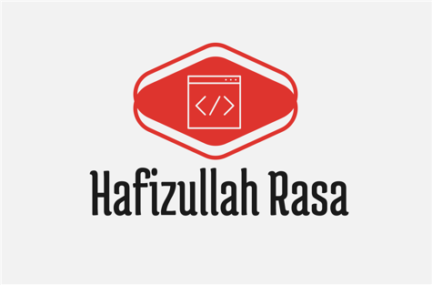

<a name="readme-top"></a>

<div align="center">
  
  <h1 align="center">Portfolio</h1>
  <p align="center">
   A sleek, modern, and fully responsive developer portfolio crafted using HTML, CSS, and JavaScript.
  </p>
</div>

---

## 📋 Table of Contents

- [📖 About the Project](#about-project)
- [🛠 Tech Stack](#tech-stack)
- [✨ Key Features](#key-features)
- [🚀 Live Demo](#live-demo)
- [💻 Getting Started](#getting-started)
  - [🔧 Prerequisites](#prerequisites)
  - [⚙️ Setup](#setup)
  - [📦 Installation](#install)
  - [📂 Usage](#usage)
  - [🚢 Deployment](#deployment)
- [👨‍💻 Author](#authors)
- [🌟 Future Features](#future-features)
- [🤝 Contributing](#contributing)
- [💖 Show Your Support](#support)
- [🙏 Acknowledgements](#acknowledgements)
- [📝 License](#license)

---

## 📖 About the Project <a name="about-project"></a>

Welcome to my first professional portfolio!  
This project showcases a **fully responsive layout** using **HTML**, **CSS**, and basic **JavaScript**, aimed at creating a sleek, personal brand identity for a frontend developer. It's a clean foundation to grow with more interactive features in the future.

---

## 🛠 Tech Stack <a name="tech-stack"></a>

### Frontend

- 💡 HTML5
- 🎨 CSS3
- ⚙️ JavaScript (Vanilla)
- ✅ Linters for code quality

---

## ✨ Key Features <a name="key-features"></a>

- 🎯 **Clean UI** with semantic HTML structure
- 🧩 **Modular CSS** for styling and layout
- 💻 **Responsive for desktop** devices
- 🧠 JavaScript file set up for future enhancements
- ✅ Configured linters to maintain code standards
- 📂 Organized file structure for easy navigation
- 📄 Includes a README with detailed project documentation

<p align="right">(<a href="#readme-top">back to top</a>)</p>

---

## 🚀 Live Demo <a name="live-demo"></a>

🌐 **Click here to view the live version:**  
👉 [Live Portfolio Site](https://hafiz1379.github.io/Portfolio/)

---

## 💻 Getting Started <a name="getting-started"></a>

To get a local copy of this project up and running, follow these simple steps:

### 🔧 Prerequisites <a name="prerequisites"></a>

- A web browser (Chrome, Firefox, etc.)
- Git installed on your machine
- A text/code editor (VS Code preferred)

---

### ⚙️ Setup <a name="setup"></a>

Clone the repository to your local machine:

```bash
git clone https://github.com/hafiz1379/Portfolio.git
cd Portfolio
```

---

### 📦 Install <a name="install"></a>

If you're using development tools like linters or package managers:

```bash
npm install
```

If not, no installation is required for static HTML/CSS projects.

---

### 📂 Usage <a name="usage"></a>

To run the project:

- Open `index.html` directly in your browser
  **OR**
- Use the Live Server extension in VS Code for better development experience.

---

### 🚢 Deployment <a name="deployment"></a>

You can deploy this site using:

- GitHub Pages
- Netlify
- Vercel
- Render
- Any static site hosting service

---

## 👨‍💻 Author <a name="authors"></a>

**Hafizullah Rasa**

- GitHub: [hafiz1379](https://github.com/hafiz1379)
- Twitter: [HafizRasa](https://twitter.com/HafizRasa)
- LinkedIn: [Hafizullah Rasa](https://www.linkedin.com/in/hafizullah-rasa-8436a1257/)

<p align="right">(<a href="#readme-top">back to top</a>)</p>

---

## 🌟 Future Features <a name="future-features"></a>

- [ ] Project section with dynamic JS rendering
- [ ] Contact form with validation
- [ ] Dark mode toggle
- [ ] Blog integration
- [ ] Enhanced animations and transitions
- [ ] SEO optimizations

---

## 🤝 Contributing <a name="contributing"></a>

Contributions, issues, and feature suggestions are welcome!
Please feel free to check the [issues page](../../issues).

---

## 💖 Show Your Support <a name="support"></a>

If you like this project, consider:

- Giving it a ⭐️ on GitHub
- Sharing it with others
- Providing feedback for improvement
- Following me on GitHub
- Reporting issues or suggesting features
- Helping with documentation improvements

---

## 🙏 Acknowledgements <a name="acknowledgements"></a>

Special thanks to:

- [Microverse](https://www.microverse.org/) for the guidance and project structure inspiration.
- Fellow developers and reviewers who provided constructive feedback.

---

## 📝 License <a name="license"></a>

This project is licensed under the [MIT License](./LICENSE).

---

<p align="center">Developed with ❤️ by Hafizullah Rasa</p>
<p align="right">(<a href="#readme-top">back to top</a>)</p>
